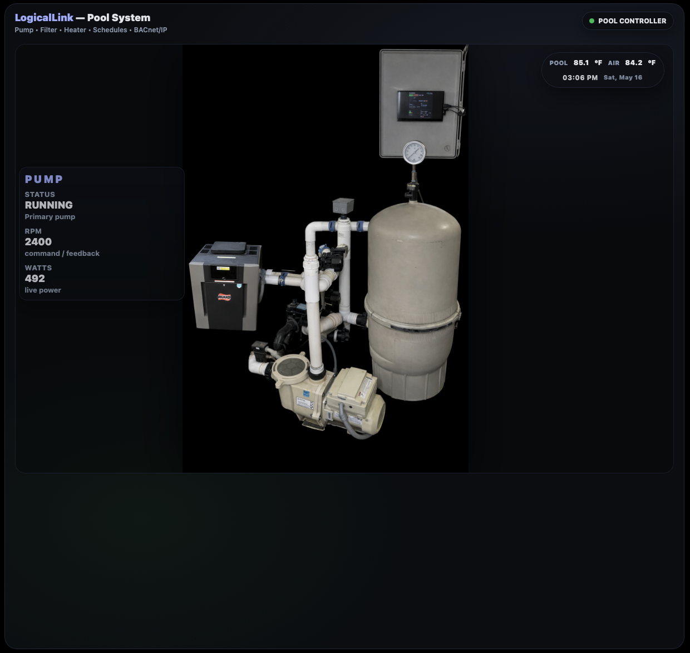
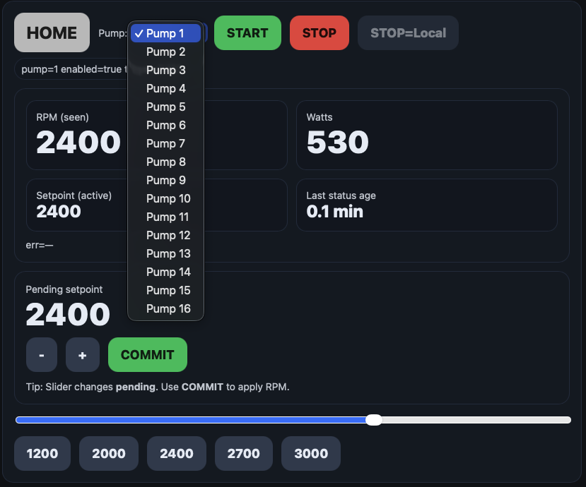
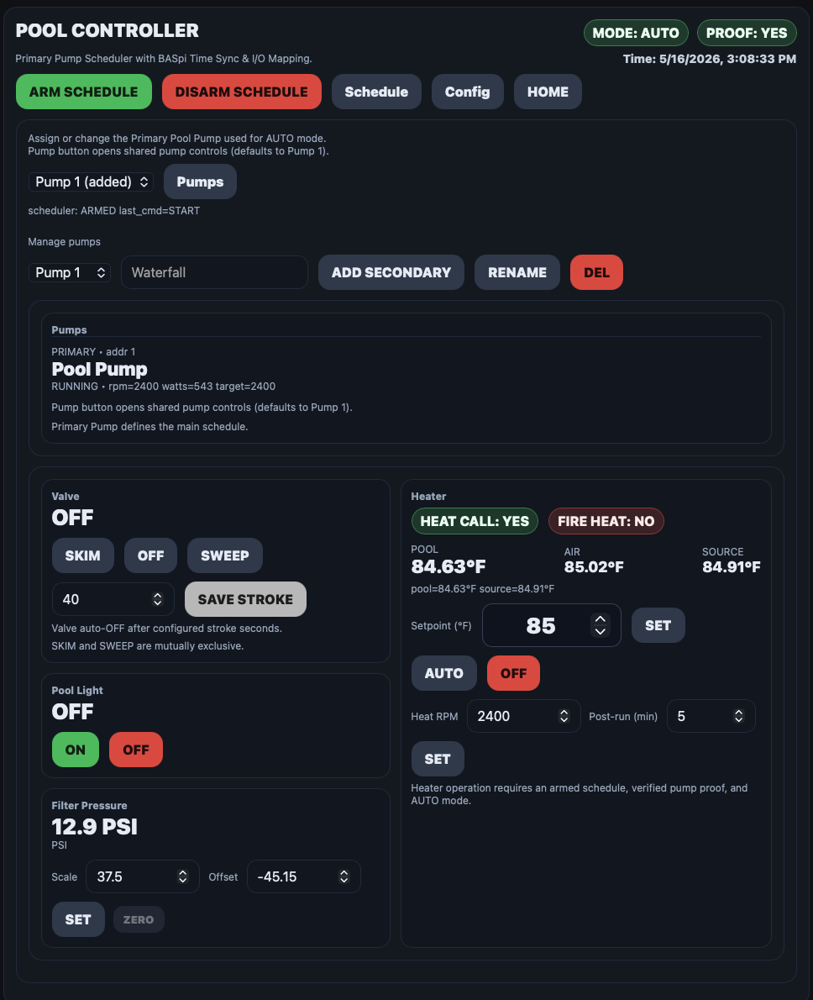
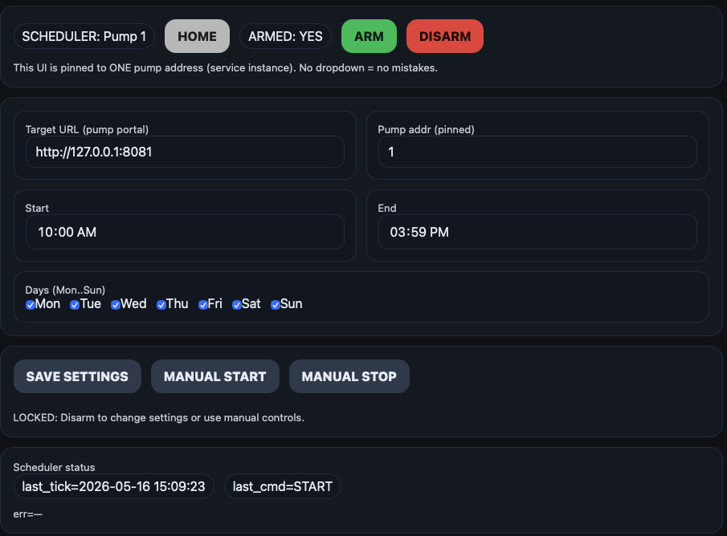

# LogicLink Pool Controller

LogicLink Pool Controller integration and PG3/eisy showcase build.

This project demonstrates:

- Pool Controller web interface
- Pump Portal integration
- Scheduler integration
- PG3/eisy integration
- API-first architecture
- Multi-service local automation architecture
- BACnet integration direction for future LogicLink systems

---

# System Architecture

| Service | Port | Description |
|---|---|---|
| Front Page | 8098 | LogicLink Front Launcher |
| Pump Portal | 8080 | Pump control system |
| Pool Controller | 8081 | Pool automation controller |
| Scheduler | 9090 | Pump scheduler |
| LL8 Config/API | 8099 | Hardware I/O and configuration |

---

# Screenshots

## LogicLink Front Page (8098)

---

## Pump Portal (8080)

---

## Pool Controller (8081)

---

## Scheduler (9090)

---

# Current Features

- Live equipment status
- Pool temperatures
- Air temperatures
- Source temperatures
- Filter PSI monitoring
- Heater enable status
- Heater firing status
- Pump proof status
- Pool light control
- Schedule armed status
- Local API integration
- PG3/eisy node server integration

---

# PG3 / eisy Integration

The LogicLink Pool PG3 integration currently supports:

- Live status updates
- Equipment control commands
- Local API communication
- Admin Console status display
- PG3 custom parameter configuration

---

# Future Direction

Future LogicLink development includes:

- True BACnet discovery
- BACnet application grouping
- Unified frontend navigation
- LogicLink controller builder integration
- Multi-controller system architecture
- Graphics/programming frontend
- Additional automation systems

---

# License

See [LICENSE](LICENSE)